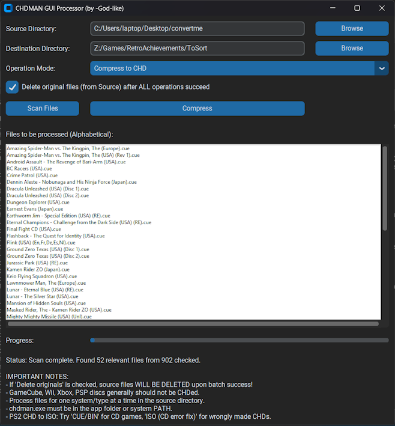

# CHDMAN GUI Processor

## Overview

This application provides a user-friendly graphical interface (GUI) for compressing disc images (such as `.cue/bin`, `.iso`, `.gdi`) into the `.chd` (Compressed Hunks of Data) format, and for extracting `.chd` files back to these disc image formats. It natively supports scanning and processing of .zip files. It utilizes `chdman.exe` (from MAME) for the conversion processes.

This tool is built using Python and the CustomTkinter library.



## Features

* **Graphical User Interface:** Modern and easy-to-use interface for managing conversions.
* **CHD Compression:** Compresses `.cue/bin`, `.iso`, and `.gdi` disc images to `.chd`.
* **CHD Extraction:** Extracts `.chd` files to:
    * `.cue/bin`
    * `.iso`
    * `.gdi`
    * `.iso` (with a fix for certain PS2 CD-based CHDs that were made incorrectly)
* **Separate Source & Destination:** Clearly define where your original files are and where the converted files should go.
* **Recursive Scanning:** Scans the source directory and its subdirectories for compatible files.
* **Batch Processing:** Process multiple files in one go.
* **Alphabetical Listing:** Displays files to be processed in alphabetical order.
* **Optional Deletion of Originals:** After a successful batch operation, you can choose to automatically delete the original source files.
* **Progress Display:** Visual progress bar and status messages keep you informed.
* **Interruptible Operations:** A "Stop Operation" button allows halting lengthy scan or conversion processes.
* **`chdman.exe` Integration:** Leverages the power of `chdman.exe` for reliable conversions.

## Prerequisites

* **`chdman.exe`:** You must have `chdman.exe`. This utility needs to be placed in the **same folder as the application executable (or Python script)**, or it must be accessible via your system's PATH environment variable. `chdman.exe` is part of the MAME (Multiple Arcade Machine Emulator) distribution.
* **Windows Operating System:** (If using a provided `.exe`). The Python script itself is cross-platform, but `chdman.exe` is typically used on Windows.

## Using the Application

### 1. Using the Standalone Executable (e.g., `CHDMAN_GUI_Processor.exe`)

1.  **Download/Place Files:**
    * Place the application executable (e.g., `CHDMAN_GUI_Processor.exe`) in a folder.
    * Place `chdman.exe` in the **same folder** as the application executable.
2.  **Run the Application:** Double-click the application executable.
3.  **Select Source Directory:** Click "Browse" next to "Source Directory" and choose the folder containing your disc images (e.g., `.cue`, `.iso`) or your `.chd` files.
4.  **Select Destination Directory:** Click "Browse" next to "Destination Directory" and choose where you want the converted files to be saved. Subdirectory structures from the source will be mirrored in the destination.
5.  **Choose Operation Mode:**
    * **Compress to CHD:** If you want to convert disc images to `.chd`.
    * **Extract from CHD:** If you want to convert `.chd` files back to disc images.
6.  **Select Extraction Format (if Extracting):** If you chose "Extract from CHD", select your desired output format (e.g., "CUE/BIN", "ISO").
7.  **Optional: Delete Originals:** Check the "Delete original files..." box if you want the source files to be automatically deleted *after all selected files in a batch have been successfully processed*. This action is permanent. Use with caution, especially if source and destination are the same.
8.  **Scan Files:** Click "Scan Files". The application will search the Source Directory for compatible files based on the selected mode and list them.
    * You can click "Stop Operation" (which appears during scanning) if needed.
9.  **Start Operation:** Once files are listed and you're ready:
    * If in "Compress to CHD" mode, the button will say "Compress".
    * If in "Extract from CHD" mode, the button will say "Extract".
    * Click this button to begin processing.
    * You can click "Stop Operation" during processing if needed.
10. **Completion:** A message will indicate when the process is complete, stopped, or if there were errors. The status bar will also provide information.

### 2. Running from Source Code

This section describes how to run the application directly using Python.

**Prerequisites (for running from source):**

* Python 3.7 or newer (from [python.org](https://www.python.org/downloads/)).
* CustomTkinter library.
* `chdman.exe` (see general prerequisites above).

**Steps:**

1.  **Download/Clone Source Code:** Obtain the Python script file (e.g., `chdman_app.py`).
2.  **Place `chdman.exe`:** Ensure `chdman.exe` is in the same directory as the Python script.
3.  **Install Dependencies:** Open a terminal or command prompt and install CustomTkinter:
    ```bash
    pip install customtkinter
    ```
4.  **Run the Script:** Navigate to the directory containing the script and `chdman.exe`, then run:
    ```bash
    python chdman_app.py
    ```
    (Replace `chdman_app.py` with the actual name of your Python file).
5.  **Using the Application Window:** Follow steps 3-10 from the "Using the Standalone Executable" section above.

## Important Warnings (from original script)

* **FILE DELETION:** If the "Delete original files..." option is checked, the application **WILL PERMANENTLY DELETE** the original source files and associated files (like `.bin` files for `.cue` sheets) after *all* selected files in a batch are processed successfully. **ALWAYS BACK UP YOUR FILES before using this feature, especially if your source and destination directories are the same.**
* **CHD Compatibility:** GameCube, Wii, Xbox, and PSP discs are generally not recommended for CHD compression due to compatibility issues with emulators or the systems themselves.
* **Single System Processing:** It's advisable to process files for only one system/type at a time within the working directory to avoid confusion or unintended operations.
* **PS2 CHD to ISO Errors:** If you encounter errors extracting PS2 CHDs to ISO:
    * The game might be a CD-based PS2 game. Try extracting using the "CUE/BIN" option.
    * The game might be a DVD ISO that was incorrectly compressed as a CD-type CHD. Try the "ISO (CD error fix)" option. (You can check Redump.org for media type: CD or DVD).

## Disclaimer

* This software interacts with `chdman.exe` and can modify or delete files based on user selections.
* Always back up your important data before using this tool.
* Use this software at your own risk. The author is not responsible for any damage or loss of data.

---
